# Instalación de un servidor Apache en Linux

## Indice
1. [Resumen](#resumen)
2. [Contexto](#contexto)
3. [Palabras Clave](#palabras-clave)
4. [Motivación](#motivación)
5. [Bibliografia](#bibliografia)

## Resumen

En esta unidad hemos aprendido a crear un **servidor web Apache** mediante Ubuntu utilizando este comando:

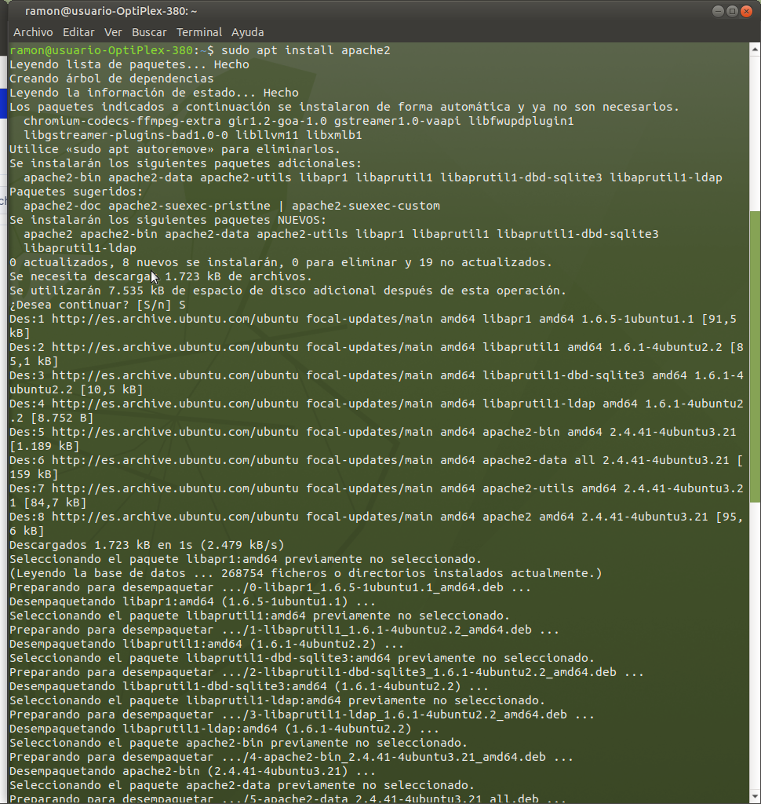
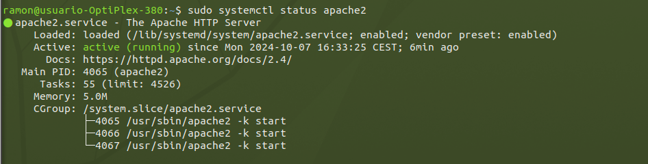

a ajustar el **firewall** del ordenador para permitir el acceso externo a los **puertos web**predeterminados.

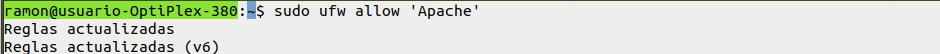
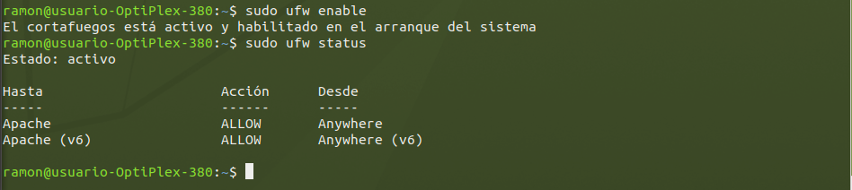

Visualizar el contenido de nuestra **pagina web de Apache**.

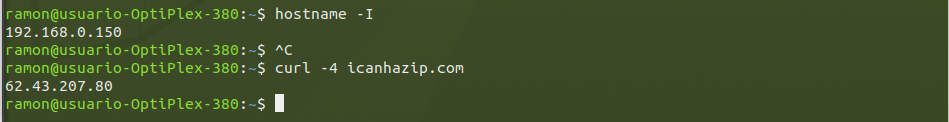
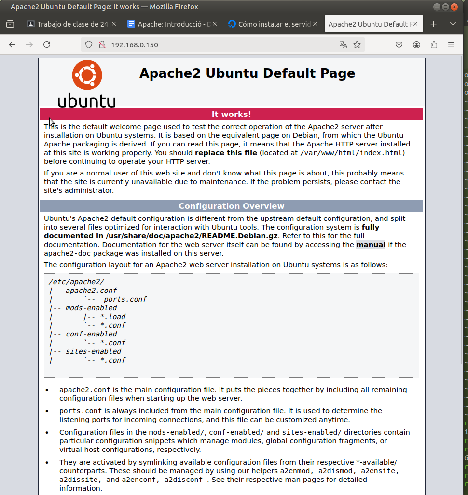

Administrar el **proceso de Apache** y sus **funciones basicas**.

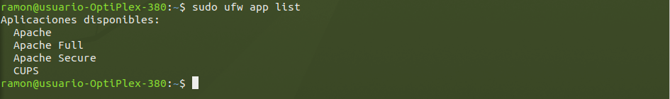
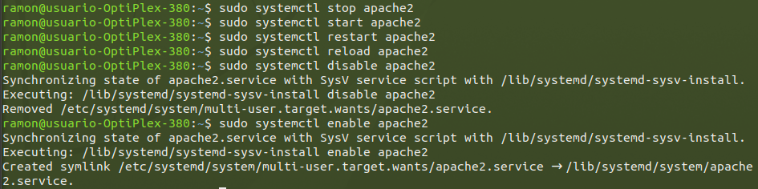

Para configurar el **servidor web apache** se realiza:

1. Crear la ruta de la pagina y crear el archivo index.html

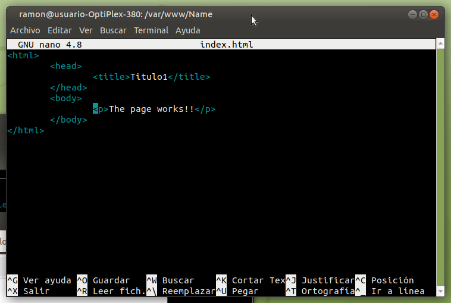

2. Editar el conf de la pagina
   
   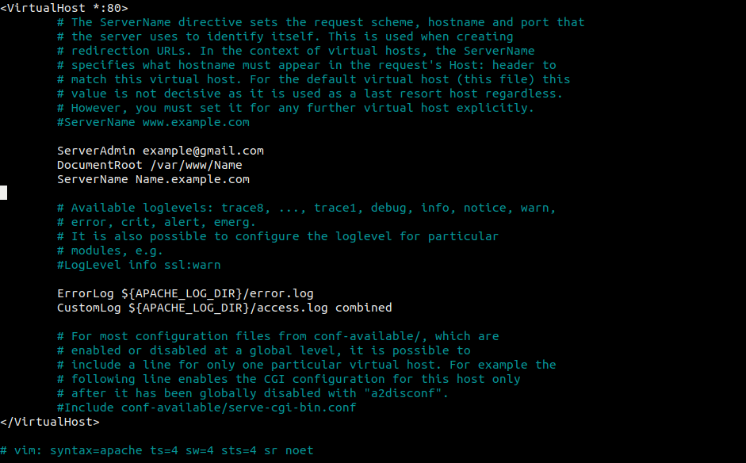
   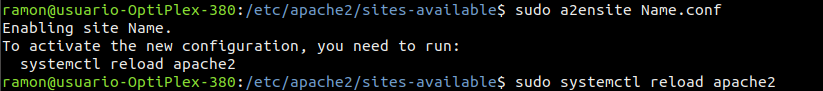
   
3.Actualizar los Hosts
  
  Añadimos la dirección que le hemos puesto en este caso es la del 170.0.0.1

  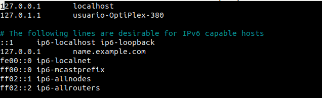

  4.Comprobar que funciona
  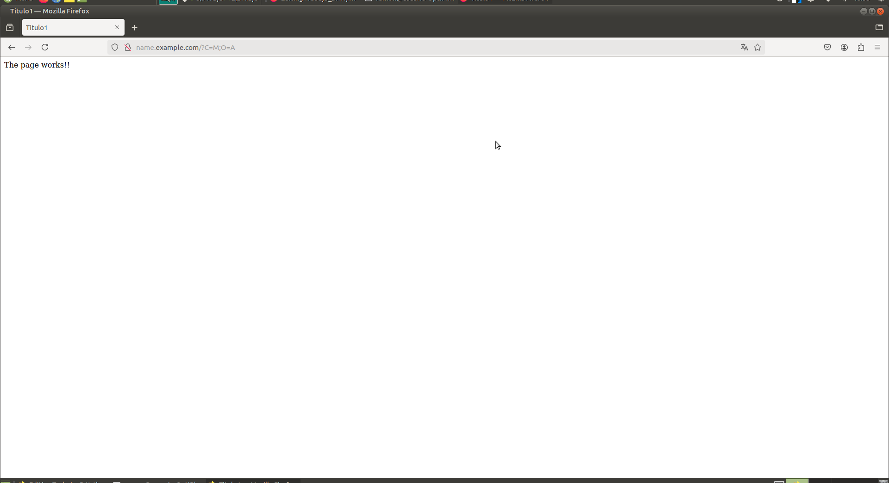

## Contexto
El proyecto se realiza en los ordenadores del centro de Academia didactica, especificamente el ordenador numero 02 del aula 9 , en el sistema operativo de Ubuntu.
En esta unidad ha utilizado sobretodo la consola de comandos de Ubuntu.
Se pdoria haber utilizado Windows realizado mediante su instalacion con el *.exe*

## Palabras Clave
* Servidor web Apache
* Firewall
* Puertos web
* Pagina web Apache
* Proceso de Apache
* Funciones basicas

## Motivación
Conseguir un servidor de Apache funcional el cual pueda editar y modificar.

## Bibliografia
* [Digital Ocean](https://www.digitalocean.com/community/tutorials/how-to-install-the-apache-web-server-on-ubuntu-20-04-es?authuser=0)
* [Tutorial de como configurar Ubuntu](https://ubuntu.com/tutorials/install-and-configure-apache)

[Volver al indice](Indice.md)
